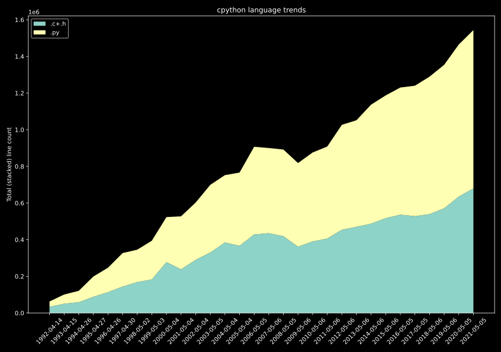

# git-repo-language-trends

Analyze programming language usage over time in a git repository and produce a
graphical or textual representation of the result.

Several output file formats are available:
* .svg - Scalable Vector Graphics
* .png - Portable Graphics Format (coming soon)
* .csv - Comma-separated values (coming soon)
* .tsv - Tab-separated values (coming soon)

Example command and its SVG output:

```
% cd ~/src/cpython
% git-repo-language-trends --max-commits 30 --min-interval-days 365 .c+.h .py
```




# Installation

Installation requires `pip>=19.0`. When in doubt, begin by upgrading `pip`:
```
python3 -m pip install --upgrade pip
```

Then simply do
```
python3 -m pip install git-repo-language-trends
```

# Usage

First go to the git repository for a project.

```
% cd ~/src/your-project
```

Then run the tool, passing the file extensions for the languages you are
interested in as positional arguments:

```
% git-repo-language-trends .java .kt
```

For language with multiple file extensions such as C, you can use the `+` syntax
which will automatically summarize line counts from both file extensions. To
compare C and Rust:

```
% git-repo-language-trends .c+.h .rs
```

# Method

Programming langauge usage is determined by the total number of newlines
in files with a given file extension.


# More examples

TODO

# Performance

This program is pretty fast, because it uses the pygit2 wrapper for the C
library libgit2. On a low-end computer (with an **Intel(R) Celeron(R) J4005 CPU
@ 2.00GHz**) it counts ~400 000 lines per second.

# Development

First clone this repo:
```
git clone https://github.com/Enselic/git-repo-language-trends.git
```
then make an editable install:
```
python3 -m pip install -e .
```
then make your changes. When done, lint and test:
```
flake8 && pytest -vv
```


# TODO
* Fix CI to use Python 3.6 for app
* print info when auto caclulating extensions to use
* Print output file path
* Support tsv and csv
* --version output
* handle shallow clones
* png output
* limit size of cache
